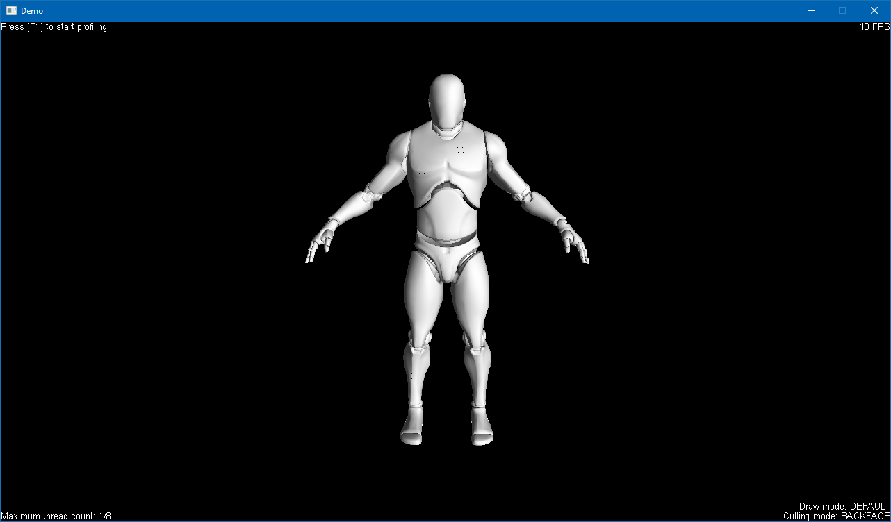

# SimplexEngine
Rendering engine with a custom made software renderer (OpenGL-like rendering pipeline)

## What is this project about ?
This project is a personnal project. My goals for this project are:
- Improving my mathematics skills
- Understanding in depth the rendering pipeline of OpenGL
- Improving my skills in project architecture
- Getting better at producing high-quality code (Well commented and easy to read as much as possible)
- Having fun doing what I like

## Software used
- Visual Studio 2017 to code

## Libraries used
- SDL2 (Window context, events and inputs)
- SDL2_ttf (For the UI, no CPU rasterization for this part)
- GyvrIni (My personal ini library)
- Assimp (3D model loader)
- GLM (Math library)

## Target platforms and configurations
The code source of this project is cross-platform, thanks to the SDL. But the actual project is made and configured with Visual Studio 2017 and target Windows.
32 bits and 64 bits are supported, debug and release

## How to build ?
The build isn't included in this repository. To build this project, the best and easiest way is to use Visual Studio 2017. All you have to do is to build in any configuration you want (Debug/Release) for any platform (x86/x64).
There are 2 projects in this repository, the actual game engine and an example project (Demo scene). You should build the engine first.

## Screenshots
### Simple scene with parent/child relations

### Unreal Engine 4 mannequin with lambert shader

### Statue with lambert shader

